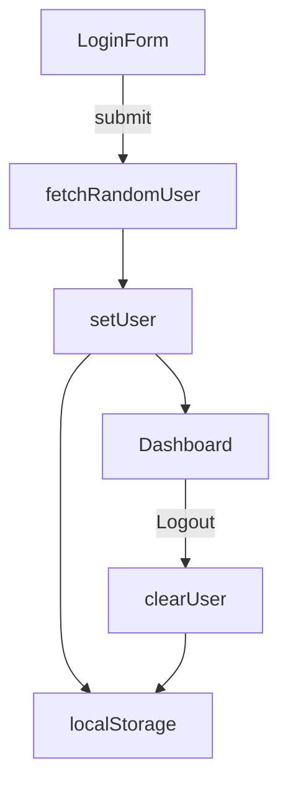

# Next 15 × TypeScript × SCSS – Auth → Dashboard Demo

A **production-ready** example app that shows how to build a tiny, type-safe authentication flow with App Router (Next.js 15), React Query, React‑Hook‑Form, Zod, SCSS Modules and strict SOLID principles.

<p align="center">
  
</p>

---

## ✨ Features

| ✓ | Module | Notes |
|---|---------|-------|
| 🔐 | **Auth → Dashboard flow** | Random user data fetched on login, persisted in `localStorage` + React Context. |
| 🗂️ | **App Router** | `app/` directory, Server & Client components side‑by‑side. |
| 🎨 | **SCSS Modules** | Module‑scoped class names, nesting, fluid `clamp()` sizing, dark‑mode‑ready colors. |
| ⚡ | **React Query** (`@tanstack/react-query`) | Suspense‑friendly, cached fetcher. |
| 🔎 | **Zod + React‑Hook‑Form** | Declarative schema, instant inline validation for Iranian phone numbers. |
| 🚦 | **SOLID** architecture | Small, single‑purpose files & pure functions; easy to swap data providers. |
| 📱 | **Responsive UI** | Works from 320 px phones to 4 K monitors without layout shifts. |
| 🧪 | **Unit‑ready** | Logic is isolated so you can snap in Jest / Vitest easily. |

---

## 🖥️ Tech Stack

| Area | Libraries |
|------|-----------|
| Core | **Next.js 15** (canary) • React 18 • TypeScript 5 |
| Data | **@tanstack/react-query** |
| Forms | **react-hook-form** • **Zod** (@hookform/resolvers) |
| Styling | SCSS Modules • CSS `clamp()` • CSS Nesting |
| Tooling | ESLint • Prettier • Husky + lint‑staged (optional) |

---

## 🚀 Quick start

### 1. Clone & install

```bash
git clone https://github.com/matinmohajer/auth-test.git
cd next15-auth-demo

# choose one
pnpm install        # ⭐ recommended
# yarn install
# npm install
```

> **Node ≥ 18** is required.  
> The project is engine‑agnostic; use npm, yarn or pnpm.

### 2. Environment variables

Create `.env.local` in the project root:

```dotenv
# .env.local
NEXT_PUBLIC_RANDOM_USER_API=https://randomuser.me/api/?results=1&nat=us
```

That’s it.  
The key starts with `NEXT_PUBLIC_`, so it is automatically exposed to the browser bundle.

### 3. Run the dev server

```bash
pnpm dev
# http://localhost:3000
```

Enter a valid Iranian phone number (e.g. `09123456789`) → click **ورود**.  
You will be redirected to `/dashboard` with your random avatar & email.

### 4. Build & start production

```bash
pnpm build     # ➜ .next/
pnpm start     # defaults to :3000
```

---

## 🗂️ Project structure

```
.
├─ app/
│  ├─ layout.tsx          – root layout (global SCSS, providers)
│  ├─ page.tsx            – redirects / ➜ /auth
│  ├─ providers.tsx       – ReactQuery + Auth provider wrapper
│  ├─ auth/               – /auth route segment
│  │  ├─ page.tsx         – login screen (Client Component)
│  │  └─ Auth.module.scss
│  └─ dashboard/          – /dashboard route segment
│     ├─ page.tsx
│     └─ Dashboard.module.scss
├─ components/
│  ├─ ui/                 – design-system atoms
│  │  ├─ Button.tsx
│  │  ├─ Input.tsx
│  │  └─ *.module.scss
│  └─ AuthForm.tsx        – RHF + Zod + React Query mutation
├─ lib/
│  ├─ context/            – React Contexts
│  │  └─ AuthContext.tsx
│  ├─ hooks/
│  │  └─ useAuth.ts
│  ├─ services/           – pure API wrappers
│  │  └─ randomUserService.ts
│  └─ validation/
│     └─ authSchema.ts
├─ public/                – static assets
└─ styles/
   └─ globals.scss
```

### Flow diagram



---

## 🔧 Scripts

| command | description |
|---------|-------------|
| `dev` | Start Next.js 15 in development mode with hot‑reload |
| `build` | Build production output |
| `start` | Run the production build (`PORT=3000` default) |
| `lint` | ESLint (next/core‑web‑vitals + import/order rules) |
| `format` | Prettier write |

> Pre‑commit hooks via Husky / lint‑staged are scaffolded but **opt‑in** – uncomment in `package.json` if you want them.

---

## 🔑 Environment variables

| key | required | default | description |
|-----|----------|---------|-------------|
| `NEXT_PUBLIC_RANDOM_USER_API` | ✅ | `https://randomuser.me/api/?results=1&nat=us` | Any endpoint that returns a [`Random User`](https://randomuser.me/)–compatible JSON. |

---

## 🛠️ Extending the project

| Task | How |
|------|-----|
| Replace random user with **real backend** | Create a new `lib/services/authService.ts`, keep the same return shape (`{ name, email, picture }`) and swap the import in **AuthForm**. |
| Persist token to **cookies / Secure Storage** | Wrap writes in a storage‑strategy module and inject via context. |
| Add **dark mode** | Introduce the `prefers-color-scheme` media query or a theme toggle; SCSS variables already scoped per module. |
| Internationalisation | Use Next.js 15 built‑in `i18n` routing or `next-intl`. |

---

## 🔒 Security & Data notes

* **No secrets** are sent to the client bundle; only a public‑safe endpoint is exposed.  
* `localStorage` is used solely for demo simplicity—swap for Secure HTTP‑Only cookies in real apps.  
* The phone‑number field is validated **entirely on the client**; add server-side validation before production.

---

## 🧩 SOLID mapping

| Principle | In practice |
|-----------|-------------|
| **S**ingle‑Responsibility | Each file does 1 thing: `AuthForm` handles form, `randomUserService` handles fetch, etc. |
| **O**pen / Closed | Swap underlying API by changing only the service file. |
| **L**iskov | `<Button>` and `<Input>` expose standard HTML props; enhanced versions remain substitutable. |
| **I**nterface‑Segregation | Pages depend on high‑level hooks (`useAuth`) not on storage details. |
| **D**ependency‑Inversion | UI doesn’t talk to `fetch` or `localStorage` directly—only through abstractions. |

---

## 🐛 Troubleshooting

| Symptom | Fix |
|---------|-----|
| `Hydration failed…` after login | Ensure **AuthProvider** implementation uses the `ready` flag from the README; restart the dev server after any `.env` edits. |
| Styles not applying | Confirm `.module.scss` import path casing matches the file system; Next on Mac/Windows is case‑insensitive but CI runners on Linux are not. |
| API blocked by CORS | Use your own backend URL or a CORS proxy during development. |

---

## 🤝 Contributing

1. Fork ➜ create feature branch (`git checkout -b feat/thing`)  
2. Commit **with conventional commits** (`feat: add x`, `fix: correct y`)  
3. Push ➜ open Pull Request  *(attach screenshots for UI changes)*

---

## 📝 License

Released under the **MIT License**.  
Feel free to fork, remix and ship 🚀.
